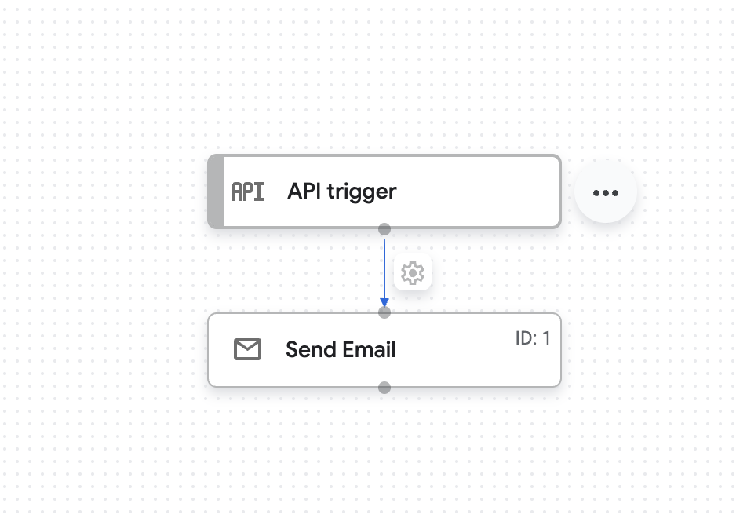

# 9 - Application Integration

This agent demonstrates how to use the `ApplicationIntegrationToolset` to connect to a Google Cloud Application Integration. This allows the agent to trigger integrations and use them as tools.

The example Application Integration is stored as a json file in folder `application_integration`.



## Code

```python
from google.adk.tools.application_integration_tool import ApplicationIntegrationToolset
from google.adk import Agent

integration_tool = ApplicationIntegrationToolset(
        project="project_id", # TODO: replace with GCP project of the connection
        location="us-central1", #TODO: replace with location of the connection
        integration="conversation_summary_cloudsql", #TODO: replace with integration name
        triggers=["api_trigger/_API_1"],#TODO: replace with trigger id(s). Empty list would mean all api triggers in the integration to be considered.
        tool_instructions="Usable to send an email of a conversation."
    )

root_agent = Agent(
    model="gemini-2.5-flash",
    name="search_agent",
    instruction="""
    Use the `integration_tool` to send a summary of the conversation to the user once the user asks for it.
    """,
    tools=[integration_tool],
)
```
